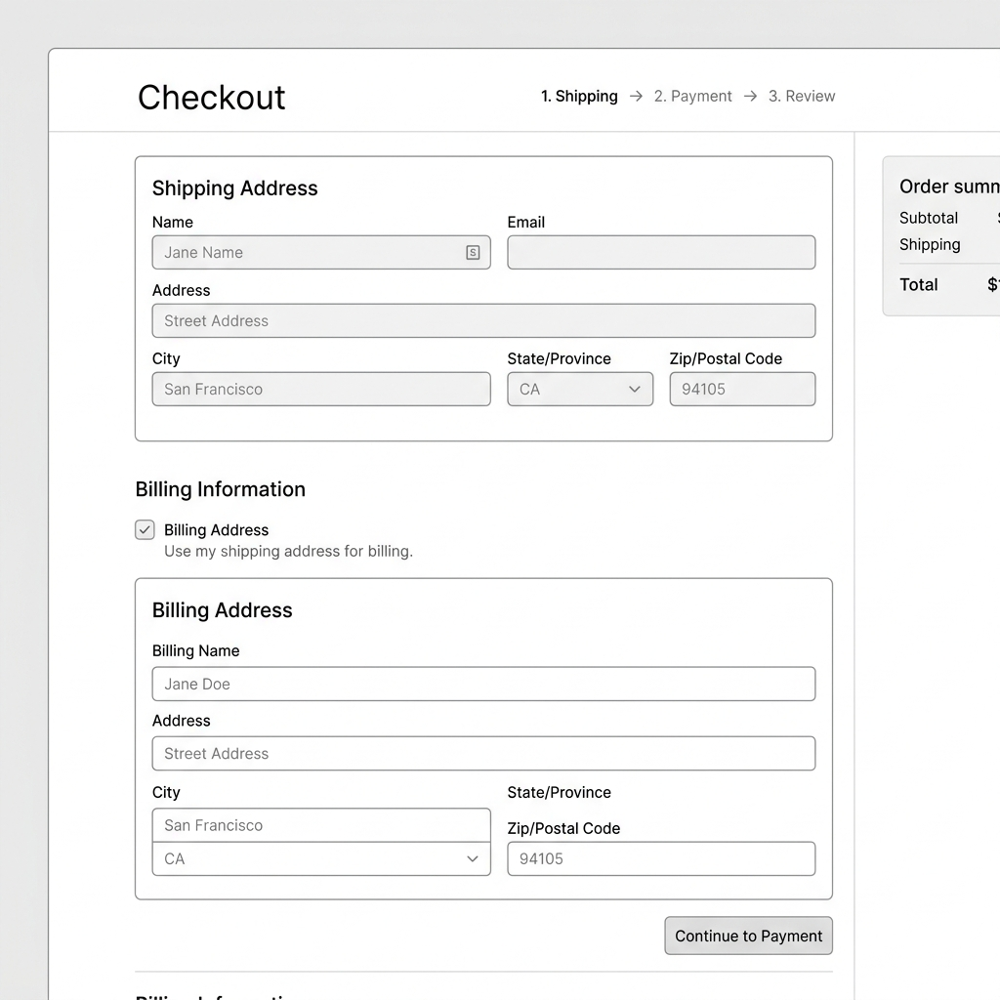

# Guest Checkout Flow

## Metadata

- **Test ID:** TC_CHKT_001
- **Domain:** Checkout
- **Priority:** High
- **Status:** Draft
- **Execution Type:** Manual
- **Tags:** `checkout`, `guest`, `credit-card`, `happy-path`

### Execution Targets

When executing this test, log the result against the specific combination of Target Locale and Viewport.

**Target Locales:**

- [x] EN-US
- [x] EN-GB
- [x] DE-DE
- [x] SV-SE

**Target Viewports:**

- [x] Desktop (Large)
- [x] Tablet (Medium)
- [x] Mobile (Small)

## Description

This test verifies the end-to-end checkout process for a guest user who is not logged in. It ensures that a user can successfully place an order without creating an account, while providing necessary shipping, billing, and payment details.

## Tester Notes

> [!TIP]
> **Keep an eye out for:**
> - Ensure the "Use my shipping address for billing" checkbox correctly hides/shows the billing form.
> - Verify that any form validation errors (e.g., missing Name) scroll into view correctly.
>
> **Visual Reference:** The billing form should slide down smoothly when unchecked.
> 
> *Example Screenshot Placeholder:*
> 

## Preconditions

- The Posters Demo Store is running and accessible.
- The user is NOT logged into the store.
- The browser cart is empty.

## Test Data

When executing this test, use the address format that matches the target language/locale of the storefront.

### Global Payment Data

- **Card Vendor:** Visa
- **Card Number:** `4111 1111 1111 1111`
- **CVV:** `123`
- **Expiry:** `12/30`
- **Email:** `guest.test@example.com`

### Address Data by Locale

| Locale | Name | Address Line 1 | City | State/Province | Zip/Postal | Country |
| :--- | :--- | :--- | :--- | :--- | :--- | :--- |
| **EN-US** | John Doe | 123 Main St | New York | New York (NY) | 10001 | United States |
| **EN-GB** | Jane Smith | 10 Downing St | London | *Not Required* | SW1A 2AA | United Kingdom |
| **DE-DE** | Max Mustermann | Musterstraße 1 | Berlin | *Not Required* | 10115 | Germany |
| **SV-SE** | Anna Nilsson | Storgatan 1 | Stockholm | *Not Required* | 114 44 | Sweden |

---

## Steps

| Step # | Action | Expected Result |
| :---: | :--- | :--- |
| 1 | Navigate to the storefront homepage. | The homepage loads successfully. The Cart shows `0` items. |
| 2 | Browse the catalog or search for a product (e.g., "Posters"). | The product listing page is displayed with results. |
| 3 | Click on any product to view its details. | The product detail page (PDP) is loaded. |
| 4 | Click the **"Add to Cart"** button. | A success notification is displayed. The cart item count increments by `1`. |
| 5 | Click on the **Cart** icon in the header. | The cart overview page is displayed showing the added product, quantity, unit price, and subtotal. |
| 6 | Click the **"Checkout"** button. | The user is redirected to the login/guest-checkout selection page. |
| 7 | Select **"Checkout as Guest"** (or continue without logging in). | The Shipping Address form is displayed. |
| 8 | Fill in valid shipping address details and click **"Next"**. | The Billing Address selection step is displayed. |
| 9 | Select **"Use Shipping Address"** (or enter a new billing address) and click **"Next"**. | The Payment Method form is displayed. |
| 10 | Enter valid test credit card details (see Test Data) and click **"Next"**. | The Order Summary/Review page is displayed. |
| 11 | Review the order details (items, addresses, taxes, shipping, totals) and click **"Place Order"**. | The user is redirected to the Order Confirmation page. |
| 12 | Verify the Order Confirmation page. | An Order Number is displayed with a "Thank you for your purchase" message. |

---

## Postconditions

- The user's cart is empty.
- An order successfully recorded in the backend (can be verified via JFR events or DB if necessary, though not strictly required for standard manual test).
- No new registered customer account was created.
